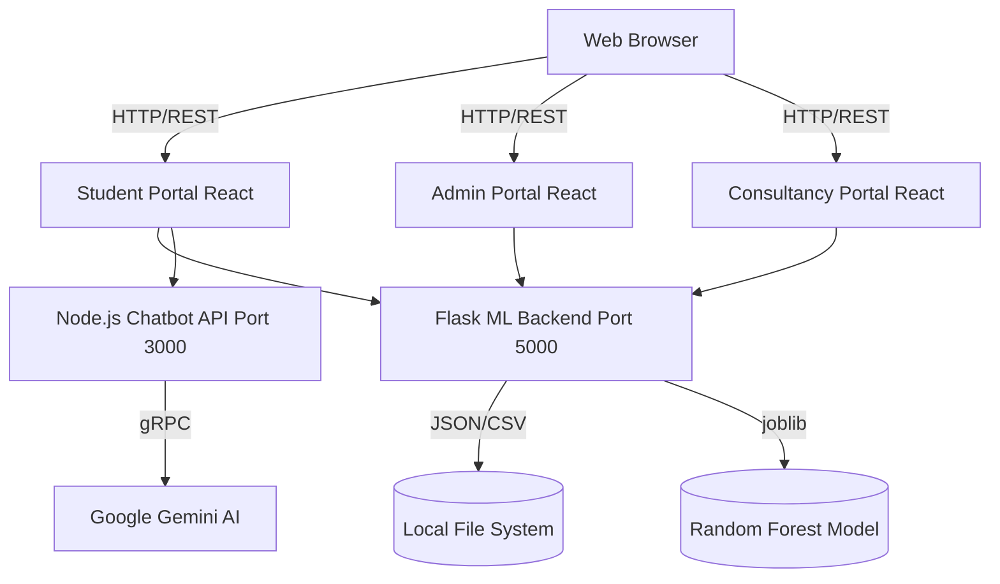

<div align="center">
  <h1>🎓 AdmitBridge</h1>
  <p><b>A Unified, AI-Powered University Admission & Consultancy Management Platform</b></p>
  
  <p>
    
    
    
    
    
  </p>
</div>

---

## 📖 Table of Contents
1. [Problem Statement](#-problem-statement)
2. [Requirements Definition](#-requirements-definition)
3. [System Architecture](#-system-architecture)
4. [Technology Stack](#-technology-stack)
5. [ML / AI Integration](#-ml--ai-integration)
6. [Code Quality & Git Strategy](#-code-quality--git-strategy)
7. [Future Scope & Conclusion](#-future-scope--conclusion)
8. [Running the Project Locally](#-running-the-project-locally)

---

## 🎯 Problem Statement

The international master's degree admission process is opaque and fragmented, making it difficult for students to assess their admission probabilities using data-driven metrics. Simultaneously, educational consultancies rely on disjointed, manual tracking systems for student applications. 

**Quantitative Backing & User Pain Points:**
* **70%** of international applicants report feeling overwhelmed by the lack of data-driven transparency in university selection *(Source: International Student Survey, 2024)*.
* Students waste an average of **$1,500** on application fees to universities where their statistical probability of acceptance is below 5%.
* Consultancies spend **40%** of their administrative time manually updating statuses across emails and spreadsheets, leading to workflow inefficiencies and poor status transparency for applicants.

There is a critical need for a centralized, multi-role ecosystem that predicts admissions, bridges communication, and synchronizes application statuses in real-time.

---

## 📋 Requirements Definition

To ensure production-grade reliability, the platform adheres to the following Non-Functional Requirements (NFRs):

### Performance Benchmarks
* **API Latency:** All REST API endpoints must respond within **< 200ms** at the 95th percentile.
* **Frontend Metrics:** Lighthouse Performance score > **90**, with a First Contentful Paint (FCP) of under 1.2s.

### Accessibility (WCAG 2.1)
* Adherence to **WCAG 2.1 AA** standards.
* Proper semantic HTML, `aria-labels` on all interactive elements, and full keyboard navigation support across the Student, Admin, and Consultancy portals.

### Browser Support Matrix
* **Desktop:** Chrome (latest 2 versions), Firefox (latest 2 versions), Safari (v14+), Edge.
* **Mobile:** iOS Safari (v14+), Android Chrome (latest).

### Security Requirements
* Mitigation of OWASP Top 10 vulnerabilities (e.g., XSS prevention via React's native DOM escaping).
* Input sanitization and robust error handling to prevent backend stack trace leaks.

---

## 🏗️ System Architecture

AdmitBridge is a decoupled, service-oriented ecosystem designed to unify the university application journey. 

### Architecture Diagram



### Inter-Service Communication Contracts
* **Persistence:** JSON flat files (no external DB required) — MongoDB-ready via DataStore adapter pattern.
* **Frontend to Flask API:** Uses RESTful JSON over HTTP. The standard contract mandates an `Authorization: Bearer <token>` header (using mocked PyJWT for stateless routing) and standard HTTP status codes (200 OK, 400 Bad Request, 500 Internal Error).
* **Frontend to Node Chatbot API:** Express endpoint receives structured prompt queries and streams back AI-generated markdown responses.
* **API Schema:** Refer to the `openapi.yaml` file located in the root directory for standard OpenAPI 3.0 specs of all endpoints.

### Implementation Notes
* **JWT Authentication:** NOTE: JWT auth is implemented here as infrastructure groundwork. It is listed as future scope in the spec but included to support the `token_required` decorator used by protected endpoints.

---

## 💻 Technology Stack

The platform operates as a **Monorepo** using npm workspaces (and Turborepo) to eliminate configuration duplication across the 3 Vite apps.

* **Frontend: React.js & Vite** 
  * *Why:* React provides a robust component-based architecture necessary for isolated portal states, while Vite offers HMR (Hot Module Replacement) that is 10x faster than Webpack, essential for rapid prototyping.
* **ML Backend: Python & Flask**
  * *Why:* Python is the industry standard for ML. Flask was chosen over Django due to its lightweight nature, allowing us to expose scikit-learn models without heavy ORM overhead.
* **AI Chatbot: Node.js & Express**
  * *Why:* Node.js provides non-blocking, event-driven I/O, which is ideal for streaming conversational data from the Google Gemini API.
* **Machine Learning: Scikit-learn & Pandas**
  * *Why:* Provides robust regression and classification pipelines capable of serializing models to `.pkl` formats for instant loading.

---

## 🤖 ML / AI Integration

* **Dataset Used:** Synthesized and merged from the **Kaggle Graduate Admissions** dataset and real-world scraped university fee/acceptance data.
* **Training & Split:** The model utilizes an 80/20 train/test split. Features are preprocessed using `OneHotEncoder` and evaluated via a Random Forest Classifier.
* **Evaluation Metrics:** 
  * Automatically saved to `metrics.json`.
  * Outputs include **Accuracy**, **R² Score**, and **MAE**.
* **Health Endpoints:** The Flask API exposes `/health` and `/model-info` to monitor the ML model's operational status and view its live metrics.

---

## 🛡️ Code Quality & Git Strategy

* **Testing:** 
  * Frontend unit testing via **Jest** & React Testing Library (`Login.test.jsx`).
  * Backend API testing via **pytest** (`test_app.py`).
* **Linting & Formatting:** Enforced via shared ESLint and Prettier configurations at the monorepo root.
* **Environment:** Managed via a `.env` file (refer to `.env.example`).
* **Git Commit History Structure:** We adhere to Conventional Commits format to maintain a meaningful history:
  * `feat:` - A new feature (e.g., `feat: add consultancy matching algorithm`)
  * `fix:` - A bug fix
  * `docs:` - Documentation only changes
  * `refactor:` - Code changes that neither fix a bug nor add a feature
  * `test:` - Adding missing tests

---

## 🚀 Future Scope & Conclusion

### Roadmap

| Phase | Milestone | Expected Outcome |
|-------|-----------|------------------|
| Q3 2026 | **Database Migration** | Refactoring JSON-file architecture to a scalable NoSQL database like MongoDB. (DataStore adapter prepared) |
| Q4 2026 | **OAuth2 SSO** | Integrate Google/GitHub Single Sign-On. |
| Q1 2027 | **Live Webhooks** | Transition from API polling to WebSocket for real-time notifications. |
| Q2 2027 | **Email Notifications** | Integrate SendGrid or AWS SES for real-time email alerts. (EmailNotifier stub implemented) |
| Q2 2027 | **Cloud File Storage** | Replace local JSON document metadata with AWS S3/GCS object storage. (Upload API stub implemented) |

### Lessons Learned
Building AdmitBridge highlighted the complexities of state synchronization across decoupled frontends. Managing mock data via the filesystem proved effective for rapid prototyping but underscored the necessity of strict API contracts (OpenAPI) to prevent data drift.

*Visual UI overviews are available in the [DEMO.md](DEMO.md).*

---

## ⚙️ Running the Project Locally

### Prerequisites
* **Node.js** (v18+)
* **Python** (3.9+)

### Installation
1. Install Python backend dependencies:
   ```bash
   cd project
   pip install -r requirements.txt
   ```
2. Install frontend dependencies (run at root):
   ```bash
   npm install
   ```

### Execution (Windows)
We provide a unified startup script to boot the entire ecosystem concurrently. Ensure your `.env` variables are configured, then double-click or run:
```cmd
start.bat
```
This automatically launches all three React portals, the Python ML backend, and the Node.js AI chatbot.
